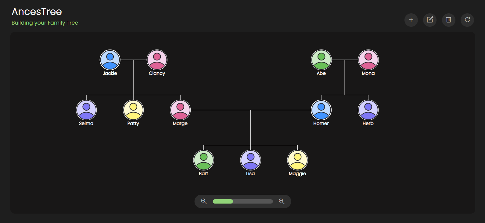

# ances-tree
A lightweight, browser-based family tree builder, built with HTM/CSS/JavaScript and [D3.js](https://d3js.org/). This site allows users to transform raw family data into a structured, interactive tree diagram.

## Features
- 📌 Add, edit, and organize family members dynamically
- 🌳 Visualize relationships using D3.js tree layouts
- 🖱️ Zoom, pan, and expand/collapse nodes for easy navigation

