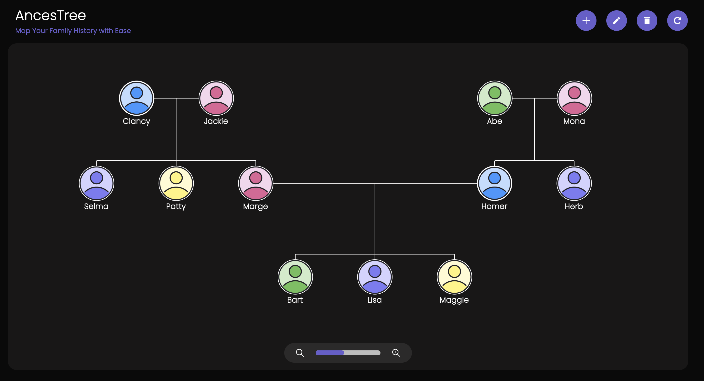

# AncesTree

A lightweight web tool used to build interactive family tree structures.  

Built with vanilla HTML/CSS/JavaScript & powered by [D3.js](https://d3js.org/) for data-driven rendering.  

## Features
- Allows full customization of each family member, including uploading custom profile images
- Supports zooming/panning features for seamless exploration of large structures
- Overrides D3’s automatic tree layout by repositioning nodes/branches to improves tree balance and readability
- Upcoming: soon to be available as a Javascript package for easy integration into other projects
